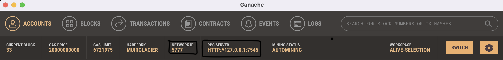
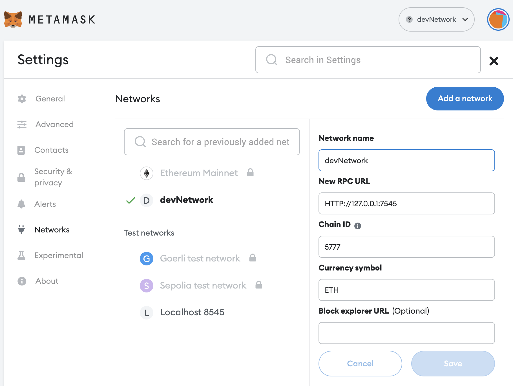
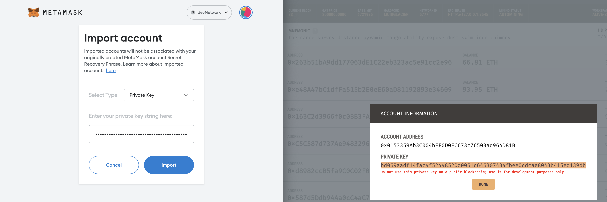
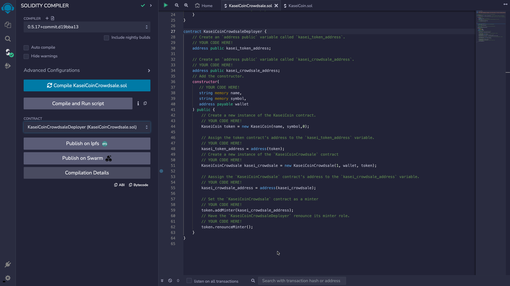

# KaseiCoin_Minter
 A crowdsale application that converts earthling money (cryptocurrency) to Martian money(KasaiCoin)

## Overview:

KaseiCoin_Minter is a solidity based Crowdsale contract that will manage the entire crowdsale process, allowing users to send ether to the contract and in return receive KAI, or KaseiCoin tokens. This contract will mint the tokens automatically and distribute them to buyers in one transaction.

KaseiCoin is a fungible token that is ERC-20 compliant and that will be minted by using a Crowdsale contract from the OpenZeppelin Solidity library.

To accomplish this, I'll do the following:

1. Create the KaseiCoin token contract.
2. Create the KaseiCoin crowdsale contract.
3. Create the KaseiCoin deployer contract.
4. Perform a real-world, pre-production test of the crowdsale. In order to do so, I will deploy the crowdsale to a local blockchain by using Remix, MetaMask, and Ganache.

## Technologies
This project leverages on Solidity version 0.5.5 with the following modules and dependencies:

* Remix IDE - An open source application for developing, deploying, and administering smart contracts that run in Ethereum-based blockchains.

* MetaMask - Use digital wallet and a gateway for the Ethereum blockchain.

* Ganache - This is an application that allows us to quickly set up a local blockchain which we can use to develop, deploy, and test smart contracts in a safe environment.

* OpenZeppelin - OpenZeppelin library provides a wide variety of contracts that are related to the ERC-20 token standard.

## Deployment steps:
* clone repo
* open remix https://remix.ethereum.org/
* install and open ganache
* install and open metamask

* Under networks in metamask add a new rpc network, name it devnetwork and input the following as seen in ganache quick start into the devnetwork fields. NETWORK ID = 5777 RPC SERVER = HTTP://127.0.0.1:7545

* save network in metamask and then grab several private keys from the ganache accounts and import those into the metamask devnetwork.

* In remix copy the solidity code from the file named KaseiCoin.sol and KaseiCoinCrowdsale.sol
* Compile the contract code with the corresponding compiler version
* On the deployment tab change the Environment to injected Provider-MetaMask then follow the steps as shown in the demo.

### Deployment process Demo

https://user-images.githubusercontent.com/78903233/201431992-aa9f21e7-1b9c-4ba9-9dcc-4ebf037d8835.mov

https://user-images.githubusercontent.com/78903233/201431255-d21fdca2-48ca-4cd3-902f-bd6e851f78fd.mov

### Deployed Contract Demo

https://user-images.githubusercontent.com/78903233/201431185-2d666c77-1abc-40f6-bed8-4a49c3264407.mov

## Evaluation Evidence

### Compiled KaseiCoin contract

### Compiled KaseiCoin_Crowdsale contract

### Compiled KaseiCoin_Crowdsale_Deployer contract

### Functionality Testing Demo

https://user-images.githubusercontent.com/78903233/201431006-3cdbe7f1-e606-44b4-ad12-d43a7215791e.mov

## Contributers

Manisha Lal

11/11/2022

manisha.lal.2009@gmail.com
___

## License
copyright 2022
